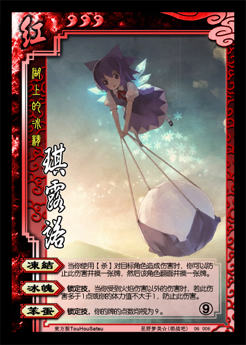

湖上的冰精——琪露诺
----------------------
<table border=0>
<tr><td>

</td>
<td>
势力：红
体力：3
编号：06006
⑨

【冻结】：当你使用【杀】对目标角色造成伤害时，你可以防止此伤害并摸一张牌，然后该角色翻面并摸一张牌。
【冰魄】：锁定技，当你受到火焰伤害以外的伤害时，若此伤害多于1点或你的体力值不大于1，防止此伤害。
【笨蛋】：锁定技，你的牌的点数均视为9。
</td></tr></table>

注1：当你使用【杀】对目标角色造成一次伤害时，先响应【冻结】，再响应【寒冰剑】；若你发动【冻结】，你不能发动【寒冰剑】效果。
注2：当你使用【杀】对非目标角色造成伤害时（例如触发连环状态），你不能发动【冻结】。
注3：当你受到火焰伤害以外的伤害时，先响应【冰魄】，再响应【白银狮子】。
注4：【笨蛋】的描述中，“你的牌”包括“你的手牌、装备区里的牌、判定牌、拼点牌”。

半吊子的控场能力，加上可以成为核心的潜力（“冻结”），这就是⑨。