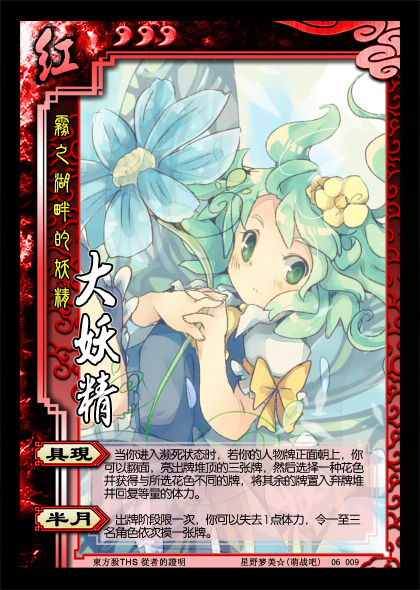

雾之湖畔的妖精——大妖精
----------------------
<table border=0>
<tr><td>

</td>
<td>
势力：红
体力：3
编号：06009
妖精是自然现象的正体。变寒回暖，下雨起风，草长花开……这些现象都有妖精寄宿当中。 ——「求闻史记」

【具现】：当你进入濒死状态时，若你的人物牌正面朝上，你可以翻面，亮出牌堆顶的三张牌，然后选择一种花色并获得与所选花色不同的牌，将其余的牌置入弃牌堆并回复等量的体力。
【半月】：出牌阶段限一次，你可以失去1点体力，令一至三名角色依次摸一张牌。
</td></tr></table>

注1：【具现】的发动时机为“当你进入濒死状态时”，此时机在求【桃】前。若你开始求【桃】，你不能再发动【具现】。
注2：你发动【具现】并选择花色时，所选花色可以与展示的牌均不同（你获得展示的牌，不回复体力）。
注3：【半月】的描述中，“依次”指“按座位顺序”。

⑨的另一位CP大妖精，同样和⑨配合良好。