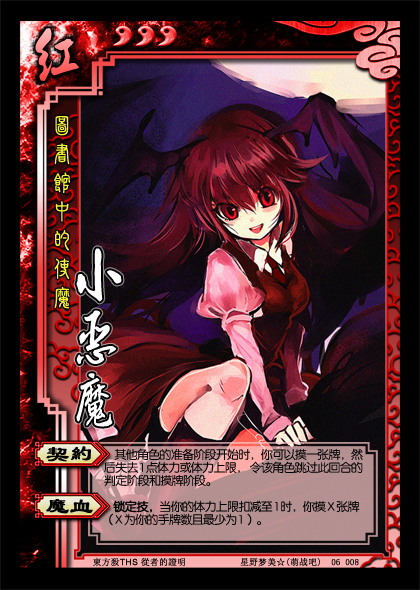

图书馆中的使魔——小恶魔
----------------------
<table border="0">
<tr><td>

势力：红
体力：3
编号：06008

【契约】：其他角色的准备阶段开始时，你可以摸一张牌，然后失去1点体力或体力上限，令该角色跳过此回合的判定阶段和摸牌阶段。
【魔血】：锁定技，当你的体力上限扣减至1时，你摸X张牌（X为你的手牌数且最少为1）。

</td></tr>
<tr><td>
注1：其他角色的准备阶段开始时，若该角色已经跳过次回合的判定阶段和/或摸牌阶段，你仍可发动【契约】。
注2：若你因发动【契约】死亡，该角色仍须跳过此回合的判定阶段和摸牌阶段。

小恶魔的一设较为匮乏，所以设计时有些脑洞大开。
同样是控制型，小恶魔还有较强的爆发力。
</tr></td></table>