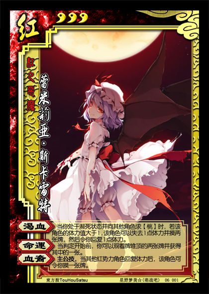

红之恶魔——蕾米莉亚·斯卡雷特
----------------------
<table border=0>
<tr><td>

</td>
<td>
势力：红
体力：3
编号：06001

【渴血】：当你处于濒死状态并向其他角色求【桃】时，若该角色的体力值大于1，该角色可以失去1点体力并摸两张牌，然后令你回复1点体力。
【命运】：当判定开始前，你可以观看牌堆顶的两张牌并获得其中的一张。
【血裔】：主公技，当其他红势力角色回复体力后，该角色可令你摸一张牌。
</td></tr></table>

注1：当你处于濒死状态并向其他角色求X张【桃】时，该角色可以发动X次【渴血】，但每次发动前，该角色的体力值均须大于1。
注2：当你处于濒死状态并向其他角色求X张【桃】时，该角色可以先发动【渴血】，再对你使用【桃】，也可以先对你使用【桃】，再对你发动【渴血】。发动【渴血】和使用【桃】令你回复的体力之和须不大于X。
注3：你发动【命运】后，你观看但未获得的牌仍置于牌堆顶。

蕾米自身并不强，但配合很强。