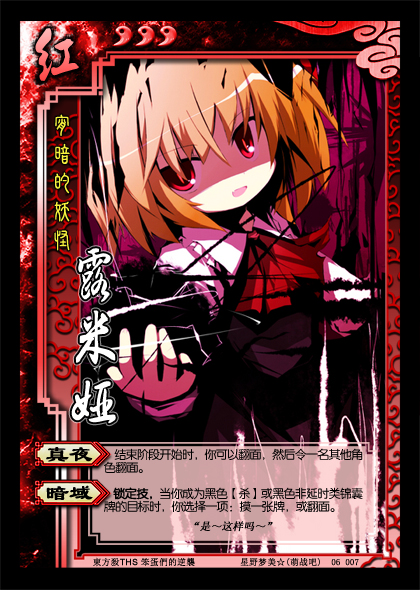

宵暗的妖怪——露米娅
----------------------
<table border="0">
<tr><td>

势力：红
体力：3
编号：06007
“是～这样吗～”

【真夜】：结束阶段开始时，你可以翻面，然后令一名其他角色翻面。
【暗域】：锁定技，当你成为黑色【杀】或黑色非延时类锦囊牌的目标时，你选择一项：摸一张牌，或翻面。

</td></tr>
<tr><td>
⑨的小伙伴之一，⑩是控场型。
</tr></td></table>