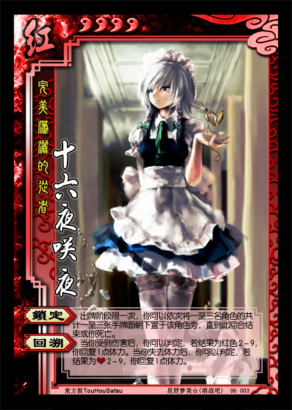

完美潇洒的从者——十六夜咲夜
----------------------
<table border="0">
<tr><td>

势力：红
体力：4
编号：06003

【锁定】：出牌阶段限一次，你可以依次将一至三名角色的共计一至三张手牌面朝下置于该角色旁，直到此回合结束或你死亡。
【回溯】：当你受到伤害后，你可以判定，若结果为红色2-9，你回复1点体力。当你失去体力后，你可以判定，若结果为红桃2-9，你回复1点体力。

</td></tr>
<tr><td>
注1：【锁定】的描述中，“置于该角色旁”即移出游戏。移出游戏的牌不属于该角色区域里的牌，无法使用、打出、弃置、获得、用作拼点牌等（除非技能明确说明）。“直到此回合结束或你死亡”即“此回合结束时或当你死亡时，将以此法置于一名角色旁的所有牌置入该角色的手牌”。
注2：当你发动【锁定】时，你先将一名角色的一张手牌移出游戏，然后你可以将一名角色的一张手牌移出游戏，也可以不再移出，依次类推，最多移出三张。
注3：若【锁定】于你发动【锁定】的回合中失效（例如绵月依姬对你发动【凭依】），【锁定】仍会继续结算（此回合结束时或当你死亡时，将以此法置于一名角色旁的所有牌加入该角色的手牌）。

咲夜和蕾米的配合十分强力。
严格来说，一设的咲夜是不能让时间倒流的，但设计时稍微模糊了一下。
</tr></td></table>