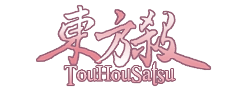

东方杀
===============

写在前面的话
---------------
从2010年8月开始进行东方人物三国杀化，这个大坑到今天终于算是完成了一大步。最初是自娱自乐的脑力游戏，如今已经程序化、甚至有了AI。要感谢一路陪伴的朋友们，感谢给我提出建议的人，更要感谢以三国有单为首的程序制作组。

这个大坑远未到完成时，旅途仍将继续。

星野梦美☆，2015.12.12

简介
--------------
东方杀电子版是基于太阳神三国杀制作的MOD。本MOD的代码采用的语言为C++，同时也支持lua扩展。

所有人物均为东方project相关人物，技能均为原创。大多数人物和技能的设计基于东方一设，部分设计基于有广泛流传度的二设。另有部分纪念性质的人物（东方年代记等）。

声明
--------------
本MOD为免费软件，实体卡牌也不会进行商业贩售。

图片来源自网络，绘师信息请详见游戏内的人物一览。若您对我们对您的图的利用产生了疑问，请联系我们撤换。

制作组
--------------
技能设计： 星野梦美☆ 三国有单 天空寺奈寺美

代码编写： 三国有单 Fsu0413 幻兰幽梦

感谢太阳神三国杀吧的吧友： 叫什么啊你妹 果然萝卜斩 大蛇 在本mod从lua版起步时给予了极大的帮助。

感谢 水晶的盟约 制作卡牌背面图。

感谢临时工 星月 和众群友吧友的支持。

官方交流群
---------------
QQ：384318315
（可以在群共享中下载程序）

源码地址
---------------
[Github][touhoukill]

有需要的朋友可以自行下载编译，编译方法详见README.vs2013文件。若对代码有疑问，请联系我们。

  [touhoukill]: https://github.com/lwtmusou/touhoukill

平衡性
---------------
技能强度较高。

平衡性调整基于2点：东方杀整体环境，及在8人局中的实用性。

不与三国杀人物进行比较，也不考虑在单挑模式中的强度（但会考虑8人局残局时的强度）。

势力划分
---------------
原则上按照初次登场的作品划分人物势力。

格斗游戏及弹幕摄影游戏（萃梦想、花映冢、文花帖、绯想天、文花帖DS、心琦楼、深秘录）因新人物较少，归为同一势力。

外传作品（求闻史记、香霖堂、秘封俱乐部、儚月抄、三月精、茨歌仙、铃奈庵）因新人物较少，归为同一势力。

主角组（博丽灵梦、雾雨魔理沙）为单独势力（详见【额外说明】）。

旧作、绀珠传人物尚未设计。

额外说明
---------------
主势力

- 主势力人物在游戏开始时选择一个势力。

- 主势力人物的身份为主公时，所有其他人物均可触发其主公技。

永久技

- 永久技是特殊的锁定技。

- 永久技和锁定技的唯一区别是永久技不能被其他技能影响（例如“常识”“凭依”）。

人物牌

- 即三国杀中的“武将牌”。

（装备改动）雌雄双股剑

- 当你使用【杀】指定其他角色为目标后，若该角色的势力与你不同，且你或该角色的势力与主公相同，你可令该角色选择一项：弃置一张手牌，或令你摸一张牌。

