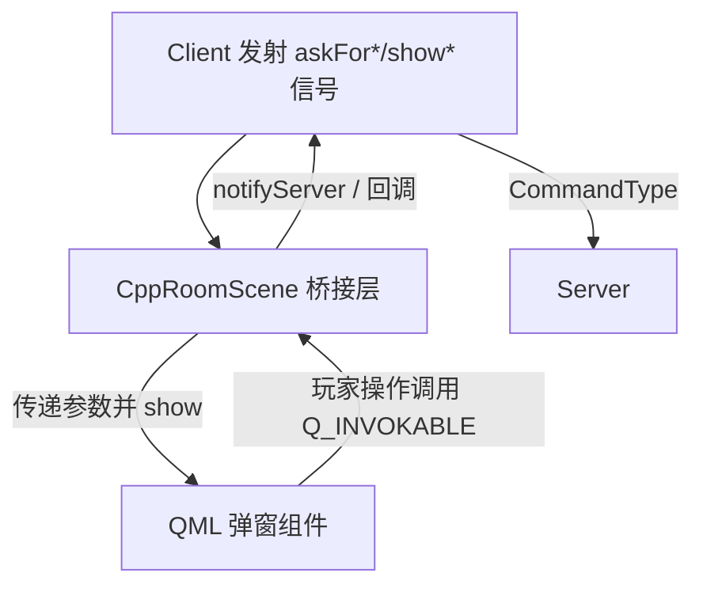

## 用户需求
将旧版基于 QGraphics 的界面代码 `src/uibackup/`（35 对 .cpp/.h，约 17k 行）重构为 QML。当前已有部分组件移植为 `qml/*.qml`，用户希望整理一份"后续还需要做什么"的清单，以便快速推进实现。

## 产品概述
以 Qt 6 QML 重写原 QGraphics 游戏界面。宿主窗口 `MainWindow` 通过 `QQuickWidget` 加载 `main.qml`，在 StartScene 与 RoomScene 间切换。目前核心布局（Photo/Dashboard/Card/StartScene/RoomScene）已成型，但游戏交互所需的弹窗、聊天、技能按钮等尚未移植，且 C++ 侧尚未把 `Client` 的请求信号桥接到 QML。

## 核心待办（剩余功能）
- [x] 建立 C++ 桥接层，将 `Client` 约 30 个 `askFor*`/`show*` 信号连接到 QML 弹窗并回传玩家响应（C++→QML 通知通路已完成；QML→C++ 回传接口 `replyToServer`/`notifyServer` 已就位，具体弹窗逐个接入中）
- 选将/分将弹窗（对应 choosegeneralbox）：askForGeneral、askForGeneral3v3、askForAssign、askForRole3v3
- 选项/触发顺序弹窗（对应 chooseoptionsbox、choosetriggerorderbox）：askForChoice、askForOrder、askForDirection、askForSuit、askForKingdom、askForTriggerOrder
- 玩家牌展示/桌面牌堆（对应 playercardbox、GenericCardContainerUI、TablePile）：showAllCards、showCard、askForGongxin、askForYiji、askForGuanxing
- 聊天与日志（对应 chatwidget、bubblechatbox、clientlogbox）
- Dashboard 技能按钮与装备区绑定（Dashboard.qml 现有 TODO）
- RoomScene 功能补全（addRobot/fillRobots、移除测试桩、宽度提示）
- 清理 `src/uibackup` 死代码与废弃 QGraphics 辅助类


## 技术栈
- 前端：Qt 6 QML（QtQuick 6.5），沿用现有 `import rocks.touhousatsu 1.0` 注册类型与 `MainWindowInstance`/`Sanguosha`/`Config` context property
- 宿主/C++ 桥接：Qt 6 `QQuickWidget` + `qmlRegisterType`/`qmlRegisterSingletonType`（位于 `src/qmlui/`）
- 构建：Qt .pro（`QSanguosha.pro`）

## 已确认的设计思路（来自 core/client 已有改动）
以下思路已由 `qt6_ui` 分支在 `src/core`、`src/client`、`src/qmlui` 中的既有改动确立，后续实现必须沿用，不要另起炉灶：

- **领域对象 Q_PROPERTY + NOTIFY 暴露（数据驱动 UI）**：`Player`/`ClientPlayer`/`Card`/`General` 已暴露为 `QObject`，带 `Q_PROPERTY` 与 `NOTIFY` 信号。例如 `Player` 的 `hp→hp_changed`、`kingdom→kingdom_changed`、`role→role_changed`、`general→general_changed`、`phase→phase_changed`、`alive→alive_changed`、`chained→chainedchanged`、`general_showed→head_state_changed`；`ClientPlayer` 的 `handcard→handcardChanged`、`mark_changed`。QML 组件（Photo/Dashboard/CardItem）直接绑定这些属性，值变化时自动刷新。setter 仅在值变化时才 emit（如 `ClientPlayer::setHandcardNum` 仅 `n != handcard_num` 时 emit `handcardChanged`）。
- **QML 类型注册（`src/qmlui/qmlui.cpp`，`Q_COREAPP_STARTUP_FUNCTION(registerCore)` 自动注册）**：
  - 可创建：`CppRoomScene`（桥接宿主）、`G`（`TouhouKillQmlUiGlobal` 单例，提供字体等全局辅助，如 `skillButtonFontFace()`/`gameFontFace()`）、`ServerInfo`。
  - 不可创建（uncreatable，仅引用属性/枚举/调用方法）：`Card`/`Player`/`ClientPlayer`/`Skill`/`ViewAsSkill`/`FilterSkill`/`ProhibitSkill`/`DistanceSkill`/`MaxCardsSkill`/`TargetModSkill`/`AttackRangeSkill`。
  - 枚举用 `Q_ENUM` 暴露（Qt6 废弃 `Q_ENUMS`）：`Card` 的 `Suit`/`Color`/`HandlingMethod`/`CardType`、`General` 的 `Gender` 等。
- **去单例化方向**：`Client.h` 注释 `Client should ABSOLUTELY NOT be a singleton`；`ClientPlayer.h` 注释 `Self should be get from Client`。当前 QML 通过 `G` 单例 + context property 访问，而非直接依赖 `Client`/`Self` 单例。桥接层挂在 `CppRoomScene`（`QQuickItem`）上，符合该方向。
- **去 Qt Widgets 文本渲染**：`ClientPlayer` 移除 `mark_doc`（`QTextDocument`），mark 改由 QML 渲染（`setMark` 时 emit `mark_changed`，QML 自行拼 HTML/图片）；`Client` 移除 `commandFormatWarning` 的 `QMessageBox`。QML 用 `Image`/`Text` 自行拼装（逻辑忠实于原实现，渲染方式用 QML 等效）。
- **Qt6 兼容性迁移（已做）**：`QRegExp`→`QRegularExpression`、`qrand`→`qsgsRand`、`Q_ENUMS`→`Q_ENUM`、头文件守卫重命名（`_X_H`→`THKILL_X_H`）、`JsonUtils::isNumber(val)` 签名调整、`[[nodiscard]]` 大量标注、`getPlayers()` 返回非 const 指针列表（便于 QML 修改属性）。

## 实现方案
### 总体策略
采用"信号桥接 + QML 弹窗"模式：在 `CppRoomScene`（`src/qmlui/roomscene.cpp`）中集中连接 `Client` 的 `askFor*`/`show*` 信号，将参数转交对应 QML 弹窗组件；QML 通过调用 `CppRoomScene` 暴露的 `Q_INVOKABLE` 方法把玩家选择回传给 `Client::notifyServer`。弹窗统一继承一个 QML 通用遮罩基类，复用现有 `CardItem`/`CardContainer`/`Photo` 等组件，保持与已移植界面一致的设计语言。

### 关键技术决策
- **桥接集中在 CppRoomScene 而非分散到各弹窗**：避免每个 QML 组件直接依赖 `Client` 单例，符合现有 `selfHelper()`/`clientHelper()` 已建立的"去单例化"方向；同时便于统一日志与错误兜底。
- **弹窗按需 create/destroy**：沿用 `RoomScene.qml` 中 `Component.createObject` 的现有范式，不常驻内存，降低开销。
- **响应回传用 Q_INVOKABLE 而非信号**：玩家操作是一次性回调，方法调用比信号更直观且可携带返回值。
- **废弃 QGraphics 辅助类（graphicsbox、sprite、pixmapanimation、sanfreetypefont 等）判定为不再需要**：QML 原生 `Image`/`Text`/`Animation` 已覆盖其能力，不移植，直接清理。

### 数据流


## 实现要点（防回归）
- **复用现有注册与 context**：不要重复注册已注册的类型/单例（`G`/`ServerInfo`/`CppRoomScene` 及 `Card`/`Player`/`ClientPlayer`/`Skill` 等 uncreatable 类型，见"已确认的设计思路"）。新弹窗只用已存在的 `rocks.touhousatsu` 类型与 `G` 单例；`Sanguosha`/`Config`/`MainWindowInstance` 等 context property 沿用现有设置，不要重复 `setContextProperty`。
- **性能**：`CardContainer.lay` 已有增量布局与 `autoBack`，弹窗内卡牌展示直接复用，避免重复遍历；弹窗销毁时 `takeItem`/`splice` 清理引用，防止内存泄漏。
- **日志**：桥接层用 `qDebug()` 记录信号名与精简参数，不打印整包 `QVariant`/大 payload，避免日志刷屏。
- **兼容性**：保留 `MainWindow` 现有 `qml_switchToRoomScene`/`configureServerText` 等接口，桥接层不要改动其签名。
- **构建**：`QSanguosha.pro:193` 引用了不存在的 `qml/CardFace.qml`，需先补建或移出 .pro，否则构建失败。

## 目录结构
```
qml/
├── CardFace.qml              # [NEW] 补建 .pro 引用但缺失的卡牌正面组件（或移出 .pro）
├── Popup.qml                 # [NEW] 通用弹窗基类：半透明遮罩 + 居中容器，供各弹窗复用
├── ChooseGeneralBox.qml      # [NEW] 选将/分将弹窗，对应 choosegeneralbox
├── ChooseOptionsBox.qml      # [NEW] 选项弹窗，对应 chooseoptionsbox
├── ChooseTriggerOrderBox.qml # [NEW] 触发顺序弹窗，对应 choosetriggerorderbox
├── PlayerCardBox.qml         # [NEW] 展示玩家手牌/装备，对应 playercardbox
├── GenericCardContainer.qml  # [NEW] 通用卡牌容器展示，对应 GenericCardContainerUI
├── TablePile.qml             # [NEW] 桌面牌堆（弃牌/判定堆），对应 TablePile
├── ChatWidget.qml            # [NEW] 聊天窗口，对应 chatwidget
├── BubbleChatBox.qml         # [NEW] 气泡聊天，对应 bubblechatbox
├── ClientLogBox.qml          # [NEW] 日志框，对应 clientlogbox
├── QSanSkillButton.qml       # [NEW] 技能按钮，Dashboard.qml:16 TODO 引用
├── Dashboard.qml             # [MODIFY] 接入 QSanSkillButton 与装备区绑定
├── RoomScene.qml             # [MODIFY] 实现 addRobot/fillRobots，移除 testItemToBeRemovedAfterTest(:246)
└── main.qml                  # [MODIFY] 实现宽度过小提示 Item(:41)

src/qmlui/
├── roomscene.h               # [MODIFY] 增加 askFor*/show* 桥接槽与响应回传 Q_INVOKABLE
└── roomscene.cpp             # [MODIFY] 连接 Client 信号到 QML 弹窗，路由玩家响应

QSanguosha.pro                # [MODIFY] 处理 CardFace.qml 缺失；最终移除 uibackup 引用
src/uibackup/                 # [DELETE] 确认无引用后整体删除（35 对死代码）
```

## 关键代码结构（桥接层接口示意）
```cpp
// src/qmlui/roomscene.h 中需新增的桥接入口（仅签名，不实现）
class RoomScene : public QQuickItem {
    Q_OBJECT
    // ...existing...
public slots:
    void showAskForGeneral(const QVariant &arg);   // 转发 Client::askForGeneral
    void showAskForChoice(const QVariant &arg);     // 转发 Client::askForChoice
    // ...其余 askFor*/show* 类似...
    Q_INVOKABLE void submitResponse(const QString &command, const QVariant &data); // 回传 Client
};
```

## 进度记录

### 已完成：C++ → QML 通知通路（2026-07-18）
- `src/qmlui/roomscene.h`：新增 `connectClientSignals()` 与约 50 个 `notify*` 信号（参数全部转换为 QML 友好类型：`QStringList`/`QVariantList`/`QObject*`/`int`/`bool`/`QVariant`），新增 `replyToServer(int commandType, QVariant data)` 与 `notifyServer(...)` 两个 `Q_INVOKABLE` 回传入口。
- `src/qmlui/roomscene.cpp`：构造函数调用 `connectClientSignals()`，用 lambda 集中连接 `Client` 的全部弹窗类（`generals_got`/`kingdoms_got`/`suits_got`/`options_got`/`cards_got`/`roles_got`/`directions_got`/`orders_got`/`triggers_got`/`guanxing`/`gongxin`/`ag_*`/`generals_filled`/`general_*`/`arrange_started`/`assign_asked`）与事件类（`log_received`/`emotion_set`/`skill_*`/`animated`/`*_spoken`/`focus_moved`/`game_*`/`player_*`/`status_changed`/`perspective_changed` 等）信号，槽内 `emit notify*`。`QList<int>`→`QVariantList`、`Card::HandlingMethod`/`Game3v3ChooseOrderCommand`/`Client::Status`→`int`、`Countdown`→`QVariant`。带 `[bridge]` 前缀的 `qDebug` 日志。
- `qml/Popup.qml`：通用弹窗基类（半透明遮罩 + 居中容器 + title + `default property alias content` + `accepted/rejected/closed` 信号 + Cancel 按钮），按需 `createObject`/`destroy`。
- `qml/RoomScene.qml`：`Connections { target: roomScene }` 接收全部 `notify*` 信号并 `console.log` 验证通路；`notifyOptionsGot` 用 `optionPopupComponent` 弹出最简选项 `Popup`，选中后调用 `roomScene.replyToServer(S_COMMAND_MULTIPLE_CHOICE, result)` 验证回传链路。
- `QSanguosha.pro`：`OTHER_FILES` 加入 `qml/Popup.qml`。

### 下一步
- 逐个弹窗实现（ChooseGeneralBox / ChooseOptionsBox / ChooseTriggerOrderBox / PlayerCardBox / GenericCardContainer / TablePile / ChatWidget / BubbleChatBox / ClientLogBox），在各自 QML 中接收对应 `notify*` 信号、调用 `replyToServer` 回传。
- Dashboard 技能按钮与装备区绑定、RoomScene addRobot/fillRobots、清理 `src/uibackup` 死代码。

