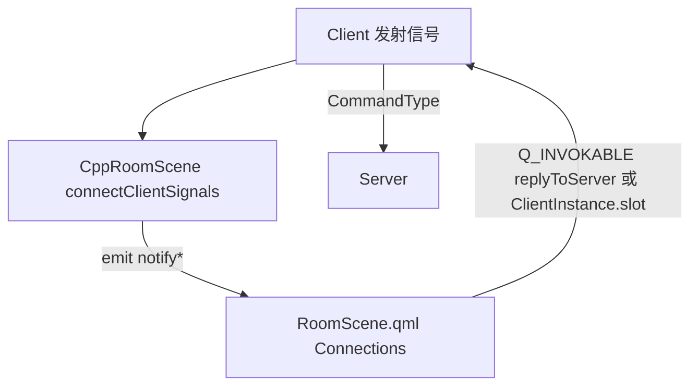

## 用户需求
将旧版基于 QGraphics 的界面代码 `src/uibackup/`（35 对 .cpp/.h，约 17k 行）重构为 QML。当前已有部分组件移植为 `qml/*.qml`，整理"后续还需要做什么"的清单以便快速推进。

## 产品概述
以 Qt 6 QML 重写原 QGraphics 游戏界面。宿主窗口 `MainWindow` 通过 `QQuickWidget` 加载 `qml/main.qml`，在 StartScene 与 RoomScene 间切换。核心布局（Photo/Dashboard/CardItem/StartScene/RoomScene）已成型，游戏交互所需的弹窗、聊天、技能按钮等尚未移植。

## 项目结构（代码阅读发现）

### C++ 侧
- `src/dialog/mainwindow.cpp`：构造 `QQuickWidget`，`setContextProperty` 暴露 `MainWindowInstance`/`Sanguosha`/`Config`，`setSource("qml/main.qml")`。提供 `qml_switchToRoomScene()` 信号供 QML 切场景。全局 `QPointer<MainWindow> MainWindowInstance`（仿 `RoomSceneInstance`），构造函数赋值，C++ 侧可访问。
- `src/qmlui/qmlui.cpp`：`Q_COREAPP_STARTUP_FUNCTION(registerCore)` 自动注册 QML 类型。
  - 单例：`G`（`TouhouKillQmlUiGlobal`，字体/游戏模式判断）、`ServerInfo`（`TouhouKillServerInfoStruct`，含 `EnableAI`/`GameMode` 等）。
  - 可创建：`CppRoomScene`（`RoomScene`，`QQuickItem` 桥接宿主）。
  - uncreatable：`Card`/`Player`/`ClientPlayer`/`Client`/`Skill`/`ViewAsSkill`/`FilterSkill`/`ProhibitSkill`/`DistanceSkill`/`MaxCardsSkill`/`TargetModSkill`/`AttackRangeSkill`。
- `src/qmlui/roomscene.h/cpp`：桥接层。`Q_PROPERTY` 暴露 `Self`（`ClientPlayer *`）、`ClientInstance`（`Client *`）；`connectClientSignals()` 集中连接 Client 信号；`Q_INVOKABLE replyToServer/notifyServer` 回传入口。全局 `QPointer<RoomScene> RoomSceneInstance`。
- `src/client/client.h/cpp`：`Client : public QObject`，全局 `QPointer<Client> ClientInstance`（注释明确不应是单例，但当前仍是）。约 50 个信号（弹窗类 + 事件类）。`getPlayers()` 已加 `Q_INVOKABLE`。`addPlayer`/`arrangeSeats`/`removePlayer` 为玩家生命周期关键方法。
- `src/client/clientplayer.h`：`ClientPlayer : public Player`，全局 `QPointer<ClientPlayer> Self`。`Q_PROPERTY` 暴露 `handcard` 等。
- `src/core/player.h`：`Player` 暴露 `seat`/`hp`/`kingdom`/`role`/`general`/`phase`/`alive`/`chained` 等 Q_PROPERTY。**注意 `seat` 无 NOTIFY**（QML 无法自动响应 seat 变化，需显式触发）。
- `src/core/protocol.h`：`QSanProtocol::CommandType` 枚举（`S_COMMAND_ADD_ROBOT`/`S_COMMAND_FILL_ROBOTS`/`S_COMMAND_CHOOSE_GENERAL` 等）、`Countdown`。
- `src/core/util.h`：`IntList2VariantList`/`StringList2IntList` 等通用转换（桥接层复用）。
- `src/uibackup/`：35 对 .cpp/.h 死代码，**不在 QSanguosha.pro 中（不编译）**，仅作参考。包含旧版 `roomscene`/`choosegeneralbox`/`chooseoptionsbox`/`cardcontainer`/`dashboard`/`photo`/`chatwidget`/`clientlogbox` 等。

### QML 侧
- `qml/main.qml`：`Image` 背景 + `scalableRoot`（固定高 1440，宽随高缩放，最小 1920）+ `RootItem`。有"宽度过小提示"TODO。
- `qml/RootItem.qml`：`currentScene` 在 StartScene/RoomScene 间切换，`Connections` 监听 `MainWindowInstance.qml_switchToRoomScene`/`qml_switchToStartScene` 用 `Component.createObject` 动态创建。
- `qml/RoomScene.qml`：根为 `CppRoomScene`。`property list<Photo> otherPhotos`（QTBUG-147713 注释）。`lay()` 按 `selfPhoto.seat` 与 `photo.seat` 计算 `effectiveSeat` 布局，`arrangement*` 按游戏模式（1v2/1v3/2v2/3v3/regular）。`Component.onCompleted` 按 `playerCount` 预创建占位 Photo（seat 2..N，未绑 player）。`Connections { target: roomScene }` 接收全部 `notify*` 信号。含 `testItemToBeRemovedAfterTest` 测试桩。`addRobotButton`/`fillRobotsButton` 已实现。
- `qml/Photo.qml`：`property ClientPlayer player` + `required property int seat`，其他属性（`general`/`kingdom`/`hp`/`role`/`screenName` 等）绑定 `player.xxx`。`Component.onCompleted` 按 GameMode 显示 RoleComboBox/HegRoleComboBox/KingdomImage。`onGeneralChanged` 默认 fallback `yingyingguai`。
- `qml/Dashboard.qml`：有技能按钮 TODO（`QSanSkillButton.qml` 待建）。
- `qml/CardItem.qml`/`CardContainer.qml`：卡牌展示组件，`CardContainer.lay` 有增量布局。

### 构建
- `QSanguosha.pro`：`SOURCES`/`HEADERS` 含 `src/qmlui/*`，`OTHER_FILES` 列举 `qml/*.qml`。`src/uibackup` 未引用。
- `compile_commands.json`：构建目录 `/Users/fs/build-QSanguosha-Qt_6-Release`，clang++ Qt6 arm64 macOS。

## 核心待办（剩余功能）
- [x] 建立 C++ 桥接层，将 `Client` 约 50 个信号连接到 QML `notify*` 并提供回传入口
- [x] RoomScene addRobot/fillRobots、notifyPlayerAdded/Removed/SeatsArranged
- [x] 选将弹窗 askForGeneral 单将选择已实现（ChooseGeneralBox）；askForGeneral3v3、askForAssign、askForRole3v3、KnownBoth 分将待做
- 选项/触发顺序弹窗：askForChoice、askForOrder、askForDirection、askForSuit、askForKingdom、askForTriggerOrder
- 玩家牌展示/桌面牌堆：showAllCards、showCard、askForGongxin、askForYiji、askForGuanxing
- 聊天与日志（chatwidget、bubblechatbox、clientlogbox）
- Dashboard 技能按钮（`QSanSkillButton.qml`）与装备区绑定
- RoomScene 移除 `testItemToBeRemovedAfterTest`、main.qml 宽度过小提示
- 清理 `src/uibackup` 死代码

## 技术栈
- 前端：Qt 6 QML（QtQuick 6.5），`import rocks.touhousatsu 1.0`
- 宿主/C++ 桥接：`QQuickWidget` + `qmlRegisterType`/`qmlRegisterSingletonType`/`qmlRegisterUncreatableType`
- 构建：`QSanguosha.pro`（qmake）

## 已确认的设计思路（来自 core/client 已有改动，后续必须沿用）
- **领域对象 Q_PROPERTY + NOTIFY（数据驱动 UI）**：`Player`/`ClientPlayer`/`Card`/`General` 为 `QObject`，QML 组件直接绑定属性，setter 仅在值变化时 emit。**例外：`Player.seat` 无 NOTIFY**，seat 变化需桥接信号显式触发 QML 更新。
- **去单例化方向**：`Client.h` 注释不应是单例；`ClientPlayer.h` 注释 Self 应从 Client 获取。QML 通过 `CppRoomScene` 的 `selfHelper()`/`clientHelper()`（`Q_PROPERTY`）访问，而非直接依赖全局。player 维护在 `Client`，QML 仅查询消费（`getPlayers()` 已 `Q_INVOKABLE`）。
- **去 Qt Widgets 文本渲染**：`ClientPlayer` 移除 `mark_doc`，mark 由 QML 渲染；`Client` 移除 `QMessageBox`。
- **Qt6 兼容性**：`QRegExp`→`QRegularExpression`、`qrand`→`qsgsRand`、`Q_ENUMS`→`Q_ENUM`、`[[nodiscard]]` 标注。

## 实现方案
### 总体策略
"信号桥接 + QML 组件"模式：`CppRoomScene` 集中连接 `Client` 信号，`emit notify*` 转发 QML；QML 通过 `Q_INVOKABLE replyToServer/notifyServer` 或直接调 `ClientInstance` 的 slot 回传。

### 关键技术决策
- **桥接集中在 CppRoomScene**：避免 QML 组件直接依赖 Client 单例，便于日志与兜底。
- **notify 信号用具体类型**：参数用 `ClientPlayer *` 而非 `QObject *`（QML 类型提示更好）；`Q_PROPERTY` 的 `Self`/`ClientInstance` 同理用具体类型。
- **响应回传用 Q_INVOKABLE 或 Client slot**：`replyToServer(int commandType, QVariant)` 通用回传；简单请求（addRobot/fillRobots）直接调 `ClientInstance.addRobot()` slot。
- **废弃 QGraphics 辅助类**：QML 原生 `Image`/`Text`/`Animation` 已覆盖，不移植。

### 数据流


## 关键代码流程（代码阅读发现）

### 玩家生命周期
- **`Client::addPlayer(player_info)`**（client.cpp:467）：解析 `[name, screen_name(base64), avatar]`，`new ClientPlayer(this)`，`setObjectName(name)`/`setScreenName`/`setProperty("avatar",...)`，`players << player`，`alive_count++`，`emit player_added(player)`。**不设 seat**。
- **`Client::arrangeSeats(seats_arr)`**（client.cpp:780）：按服务器给的 player_names 顺序，`players.clear()` 重建，`setSeat(i+1)`/`setNext`，`emit seats_arranged()`（无参）。seat 在此时才设置。
- **`Client::removePlayer(player_name)`**（client.cpp:502）：`findChild` 按 objectName 查找，`setParent(nullptr)`，`alive_count--`，`emit player_removed(name)`，`players.removeOne`，`connect(this, destroyed, player, deleteLater)`。**player 对象不立即销毁**，等 Client 销毁时 deleteLater。

### QML 场景切换
- `MainWindow::qml_switchToRoomScene()` 信号 → `RootItem.qml` `Connections.onQml_switchToRoomScene` → 销毁 currentScene，`roomSceneComponent.createObject` 创建 RoomScene。此时 ClientInstance/Self 已存在，`RoomScene` 构造函数立即 `connectClientSignals()`。

### RoomScene 布局
- `lay()` 遍历 `otherPhotos`，`effectiveSeat = (photo.seat - selfPhoto.seat + playerCount) % playerCount`，按 `arrangement[右/上/左]` 分配位置。`selfPhoto.seat` 与 `photo.seat` 必须先设置（由 `notifySeatsArranged` 从 `player.seat` 回填）。

## 实现要点（防回归）
- **复用现有注册与 context**：不重复注册 `G`/`ServerInfo`/`CppRoomScene` 及 uncreatable 类型；`Sanguosha`/`Config`/`MainWindowInstance` context property 沿用。
- **Qt6 moc 完整类型要求**：`Q_PROPERTY(T *)` 中 `T` 必须完整定义（否则 `static_assert(is_complete<...>)` 失败）。`roomscene.h` 需 `#include "client.h"`/`"clientplayer.h"`，不能用前置声明。
- **`Player.seat` 无 NOTIFY**：seat 变化 QML 无法自动感知，必须在 `notifySeatsArranged` 显式读 `photo.player.seat` 回填 `photo.seat`。
- **`QList<int>` 转换**：复用 `util.h::IntList2VariantList`，勿手写循环。
- **避免 const_cast**：信号参数如需非 const 传 QML，直接改 Client 信号签名去 const（如 `cards_got`/`skill_acquired`）。
- **qmllint 假告警**：未生成 qmltypes 时 `CppRoomScene`/`rocks.touhousatsu` 未识别，导致大量 `unqualified`/`missing-type` warning，构建后消除，非真实错误。
- **日志**：桥接层 `qDebug` 带 `[bridge]` 前缀，不打印大 payload。
- **兼容性**：保留 `MainWindow` 现有 `qml_switchToRoomScene` 等接口签名。

## 目录结构
```
qml/
├── CardFace.qml              # [待建] .pro 曾引用但缺失，需补建或移出
├── GraphicsBox.qml           # [NEW] 图片背景可拖拽容器基类（无标题/无操作按钮），供各弹窗复用
├── Popup.qml                 # [搁置] 通用弹窗基类与整体设计不符已删，弹窗容器后续按需设计
├── ChooseGeneralBox.qml      # [已完成] 单将选择（generals_got→onPlayerChooseGeneral）；KnownBoth/分将待实现
├── ChooseOptionsBox.qml      # [NEW] 选项弹窗
├── ChooseTriggerOrderBox.qml # [NEW] 触发顺序弹窗
├── PlayerCardBox.qml         # [NEW] 玩家手牌/装备展示
├── GenericCardContainer.qml  # [NEW] 通用卡牌容器
├── TablePile.qml             # [NEW] 桌面牌堆
├── ChatWidget.qml            # [NEW] 聊天窗口
├── BubbleChatBox.qml         # [NEW] 气泡聊天
├── ClientLogBox.qml          # [NEW] 日志框
├── QSanSkillButton.qml       # [NEW] 技能按钮，Dashboard.qml TODO 引用
├── Dashboard.qml             # [MODIFY] 操作按钮已加（Trust 完整，OK/Cancel/Discard 待卡牌选择）；技能按钮/装备区待接入
├── RoomScene.qml             # [MODIFY] 移除 testItemToBeRemovedAfterTest
└── main.qml                  # [MODIFY] 宽度过小提示

src/qmlui/
├── roomscene.h/cpp           # [已完成] 桥接层
└── qmlui.h/cpp               # [已完成] 类型注册

src/client/client.h/cpp       # [已改动] getPlayers Q_INVOKABLE、cards_got/skill_acquired 去 const、seats_arranged 删参
src/uibackup/                 # [DELETE] 确认无引用后整体删除
```

## 进度记录

### 已完成：C++ → QML 通知通路（2026-07-18）
- `src/qmlui/roomscene.h`：`connectClientSignals()` + 约 50 个 `notify*` 信号（QML 友好类型）；`Q_PROPERTY` 的 `Self`/`ClientInstance` 改具体类型 `ClientPlayer *`/`Client *`（需 include 完整定义满足 moc）；`Q_INVOKABLE replyToServer/notifyServer` 回传入口。
- `src/qmlui/roomscene.cpp`：lambda 集中连接 Client 全部信号，`emit notify*`；`QList<int>` 复用 `IntList2VariantList`；`[bridge]` 日志。
- `src/client/client.h`：`cards_got`/`skill_acquired` 去 const；`getPlayers()` 加 `Q_INVOKABLE`；`seats_arranged()` 删参数。
- `qml/RoomScene.qml`：`Connections` 接收全部 `notify*`。

### 已完成：RoomScene 基础功能（2026-07-18）
- `notifyPlayerAdded`：找 `player === null` 的 Photo 绑定 newPlayer（seat 未设，不在此绑）。
- `notifySeatsArranged`：无参，读 `photo.player.seat` 回填 `photo.seat`，更新 `selfPhoto.seat`，`lay()`。
- `notifyPlayerRemoved`：按 `objectName` 匹配，清空 Photo.player。
- `addRobotButton`/`fillRobotsButton`：`onClicked` 调 `ClientInstance.addRobot()/fillRobots()`；`visible` 含 `ServerInfo.EnableAI`。

### 已完成：Dashboard 操作按钮（2026-07-18）
- `qml/Dashboard.qml`：新增 Trust/Discard/Cancel/OK 四个 `QSanButton`（268×133，`font.pixelSize: 50`），用 `anchors.bottom: cardArea.top` + `bottomMargin: 8` + `horizontalCenter: cardArea.horizontalCenter` 浮在手牌区上方。
- Trust 完整可用（`onClicked: clientInstance.trust()`，`Client::trust` slot）。
- Discard/Cancel/OK 为 UI 占位（`enabled: false` + TODO）：依赖 `CardItem.selected`（当前注释掉）与 target 选择、`Client.status`（无 NOTIFY）未实现。
- `clientInstance` 属性：`parent ? parent.ClientInstance : null`（Dashboard parent 是 RoomScene 的 CppRoomScene）。

### 已完成：GraphicsBox 基类（2026-07-18）
- `qml/GraphicsBox.qml`：以 `Image` 为根的图片背景容器基类（参照旧 Popup.qml 但去标题/操作按钮/信号、无 z）。直接用 Image 的 `source` 属性设背景图（子类设 `source: G.getUrl(...)`）；`default property alias content` 供子类填充内容；默认尺寸 720×360（可覆盖）；`MouseArea` `drag.target` 支持拖拽移动（子内容 MouseArea 在上层优先接收点击，空白区拖拽）；`Component.onCompleted` 初始居中（用 x/y 而非 anchors，兼容拖拽）。
- `QSanguosha.pro`：`OTHER_FILES` 加入 `qml/GraphicsBox.qml`。

### 已完成：ChooseGeneralBox 单将选择（2026-07-18）
- `qml/ChooseGeneralBox.qml`：基于 GraphicsBox 的选将弹窗（720×460，背景 `card-container.png`）。`property var generals` + `property bool singleResult` + `property var selectedGenerals`；GridView 用 CardItem 显示，`_toggle` 切换选中（单将选1，双将选最多2，回传 `name1+name2`）；选中 scale 1.1。**无自带 OK**，Dashboard OK 触发 `accept()`。右键 CardItem + `ServerInfo.FreeChoose` 调 `parent.freeChooseGeneral()` 弹 C++ FreeChooseDialog 换将该位。
- `qml/RoomScene.qml`：`onNotifyGeneralsGot` 传 `singleResult`，设 `activeChooseGeneralBox`，`generalChosen` 连接 `ClientInstance.onPlayerChooseGeneral(name)`。
- `qml/Dashboard.qml`：OK 按钮 `enabled` 绑定 `activeChooseGeneralBox.selectedGenerals.length > 0`，`onClicked` 调 `accept()`。
- `src/client/client.cpp`：`askForGeneral` 非国战分支 `setStatus(ExecDialog)` → `setStatus(AskForGeneralTaken)`。
- `src/client/client.h/cpp`：`Q_PROPERTY(Status status ... NOTIFY status_changed)`，`status_changed` 信号改为规范单参 `status_changed(Status newStatus)`（原双参 old/new 不符合 Qt NOTIFY 规范），`setStatus` 同步 emit 并移除无用 `old_status`；桥接 `notifyStatusChanged(int newStatus)` 单参。
- `src/qmlui/roomscene.h/cpp`：新增 `Q_INVOKABLE freeChooseGeneral()`，弹 C++ `FreeChooseDialog`（modal exec，parent 用全局 `MainWindowInstance`），连接 `general_chosen` 捕获将名返回。
- 流程：`generals_got` → ChooseGeneralBox → 选将（右键可 freechoose 换将）→ Dashboard OK → `accept()` → `onPlayerChooseGeneral`（`replyToServer(S_COMMAND_CHOOSE_GENERAL)`，双将 `name1+name2`）。
- KnownBoth 是"知己知彼"卡牌效果（非国战双将），未实现。
- `QSanguosha.pro`：`OTHER_FILES` 加入 `qml/ChooseGeneralBox.qml`。

### 下一步
- CardItem 卡牌选择（`selected` 状态 + 信号）→ 打通 OK/Cancel/Discard。
- 逐个弹窗实现，在各自 QML 接收 `notify*`、调用 `replyToServer` 回传。
- Dashboard 技能按钮（`QSanSkillButton.qml`）、RoomScene 移除测试桩/宽度提示、清理 `src/uibackup`。
